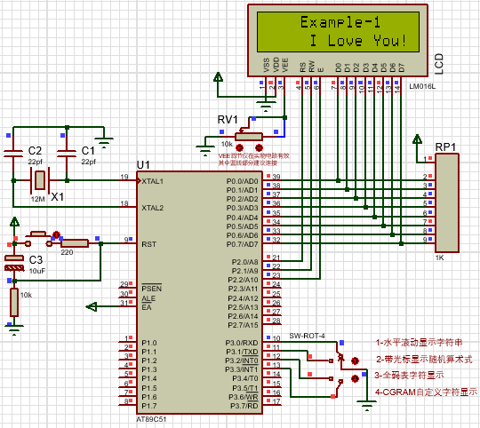
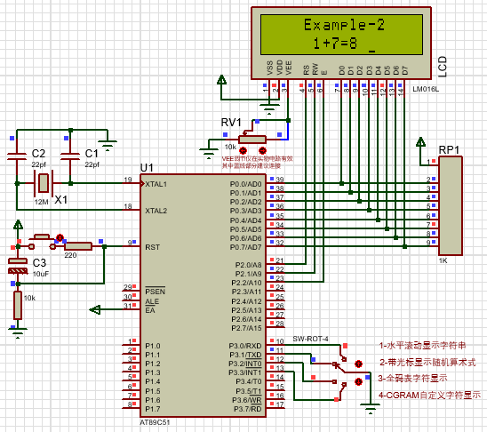
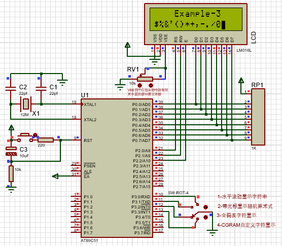
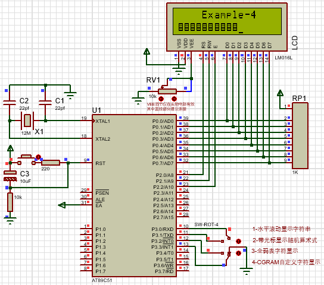

# DSP
DSP技术及应用

## 目录说明

### work01
> work01是8051芯片和LCD1602模拟完成的demo  
> 共实现四个功能：
> - 水平波动显示字符串
> - 带光标显示随机算术式
> - 全码表字符显示
> - CGRAM自定义字符显示
#### 效果图
**1. 水平波动显示字符串**  

**2. 带光标显示随机算术式**  

**3. 全码表字符显示**  

**4. CGRAM自定义字符显示**  
